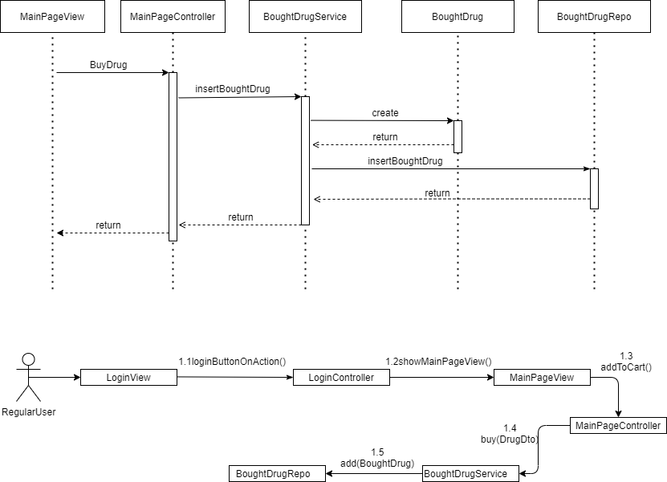

# Pharmacy Specification
The Pharmacy is an application which helps regular users to see, to compare and to buy drugs online.

# Elaboration – Iteration 1.1

## Domain Model

## Architectural Design

### Conceptual Architecture
As architectural style and pattern is used **Layered**, because each layer has a specific role and responsability.This type pf component classification makes it easy to build effective roles and responsibility models, and also makes it easy to develop, test, and maintain the application.

### Package Design

### Component and Deployment Diagrams

# Elaboration – Iteration 1.2

## Design Model

### Dynamic Behavior
Below is presented the sequence and communication diagrams for buying a drug scenario:

Below is presented the sequence and communication diagrams for generating a raport for an user scenario:

 

### Class Design

The Factory Method pattern is used to generate different types of reports.

### Data Model

There are 3 tables
- User(table with users data)
- Drug (table with drugs in stock)
- BoughtDrug (table with bought drugs)

Between User table and BoughtDrug table exists a relationship of One-to-Many(One user can have 0 or more bought drugs).

### Unit Testing
[Present the used testing methods and the associated test case scenarios.]

The app was tested using JUnit and Mockito Framework. The unit testing covered all the view interfaces of the application. For example, login tests was made for all possible scenarios:
- failure login: when the username/password or both was wrong the interface should show an error message.
- succes login: when the username/password was correct, the interface should show the adminPage or mainPage.

Another test covered the registration interface:
- failure register: were made 4 tests for every field which cannot be blank and 2 tests for password/username if the length is smaller than 8 charcaters, in this case a error message should appear.

# Elaboration – Iteration 2

## Architectural Design Refinement
[Refine the architectural design: conceptual architecture, package design (consider package design principles), component and deployment diagrams. Motivate the changes that have been made.]

These changes was needed because from a MVC arhitectural pattern the application has changed in a client server arhitectural pattern. This pattern has two big components client which is computed by views, controllers of views and report factory which helps the user to use the application and interact with application, and the server which interact with the database and does all the business logic of application.

## Design Model Refinement
[Refine the UML class diagram by applying class design principles and GRASP; motivate your choices. Deliver the updated class diagrams.]

# Construction and Transition

## System Testing
[Describe how you applied integration testing and present the associated test case scenarios.]

Integration testing is the phase of sofware testing in which individula sofware modules are combined and tested as a group. For the integration testing
was applied a sandwich approach which combines top-down testing with bottom-up testing. Some relevant test scenarios for these Integration Testing are:

- UserPageTest:
	- if an user wants to add a drug to their shopping cart he will get a message if it is succesfully or a message with the error occured
	- continue with the order and a confimrming message will be prompted
	- rating a specific drug

- AdminPageTest:
	- delete drug/user test
	- invalid discount test
	- wrong drug fields
	- user modified with success

and so on

## Future improvements

- Implementation of all the features which was not implemented yet
- Making the data access operations faster
- Transform the desktop app in a web application
- Introducing the feature of making a review by user to different drugs
- Beautify the UI interface

# Bibliography
- [Architectural Styles](https://docs.microsoft.com/en-us/azure/architecture/guide/architecture-styles/)
- [Architectural Patterns and Styles](https://msdn.microsoft.com/en-us/library/ee658117.aspx)
- [Design Patterns](https://sourcemaking.com/design_patterns)
- [UML Artifacts list](http://agilemodeling.com/artifacts)
- [Component diagram](http://agilemodeling.com/artifacts/componentDiagram.htm)
- [Deployment diagram](http://agilemodeling.com/artifacts/deploymentDiagram.htm)
- [Package diagram](http://agilemodeling.com/artifacts/packageDiagram.htm)
- [Sequence diagram](http://agilemodeling.com/artifacts/sequenceDiagram.htm)
- [Communication diagram](http://agilemodeling.com/artifacts/communicationDiagram.htm)
- [UML Diagrams](https://www.uml-diagrams.org/)
- [Online diagram drawing software](https://yuml.me/) ([Samples](https://yuml.me/diagram/scruffy/class/samples))
- [Yet another online diagram drawing software](https://www.draw.io)
