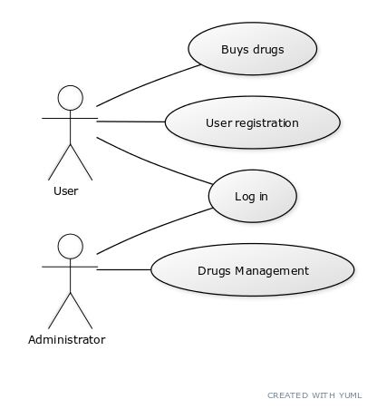

# Pharmacy - Use Case Model

# Use-Cases Identification
[Identify actors, scenarios and use cases. Describe the three most important use-cases according to the following use case specification format]:

In this app there are 2 types of users:
* **Administrator**: has the ability to manipulate the data of both drugs and regular users
* **Regular User**: his rights are limited to: view and search the drugs, buy drugs, rate drugs and add drugs to thier favourites list.

## Use case 1
* **Use case**: ****Buys drugs****
* **Level**: user-goal level
* **Primary actor**: User/Client
* **Main success scenario**: We will reach this page only if the user is logged in, from the Login page, then select one item, fill in the number of the item he wants, and then validate this by a button.
* **Extensions**: As extensions he can add more items in his shopping cart, and then to buy all drugs by one click on the button.

## Use case 2
* **Use case**: ****User registration****
* **Level**: user-goal level
* **Primary actor**: User/Client
* **Main success scenario**: The application requires an account, so if there is no already createdd, the user can create a new account by pressing the "Sign Up" button, which will redirect to an account creation page. After the required data has been entered, click on the "Register" button.
* **Extensions**: If an user already has an account, he just log in the application.
		  If that email or username have been used before, a message will be displayed.

## Use case 3
* **Use case**: ****Drugs Management****
* **Level**: user-goal level
* **Primary actor**: Administrator
* **Main success scenario**: The Administrator must acces the drugs managemnet page and complete text inputs which correspond to the name,type,price, etc. of a certain drug, then it can be added if it did't exist or deleted/modified if it exists.
* **Extensions**: -

## Use case 4
* **Use case**: ****Login****
* **Level**:  user-goal level
* **Primary actor**: Admin/User
* **Main success scenario**: Fullfill the credentials in the Login page, and if the actor is a user it redirects to Main page, or if it is an admin it redirects to Admin page.
* **Extensions**: If the credentials are wrong, a message will be displayed.

# UML Use-Case Diagrams
[Create the UML Use-Case Diagrams.]

## Diagram 1

# Bibliography

* [Use Cases (specification)](https://www.visual-paradigm.com/guide/use-case/what-is-use-case-specification/)
* [Use Case diagram](http://agilemodeling.com/artifacts/useCaseDiagram.htm)
* [Use Case diagram guidelines](http://agilemodeling.com/style/useCaseDiagram.htm)
* [Online diagram drawing software](https://yuml.me/) ([Samples](https://yuml.me/diagram/nofunky/usecase/samples))
* [Yet another online diagram drawing software](https://www.draw.io)
